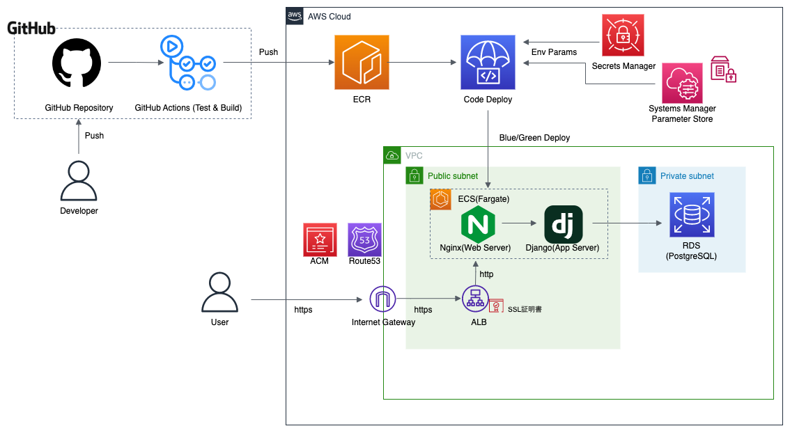

# TODOList_IzmYuta

## 環境
- 言語：Python
- Webフレームワーク：Django REST framework
- DB：PostgreSQL
- 開発環境：Docker Compose
- Lint：black
- Format：flake8
- 開発環境コマンド：make(Makefile)
- CI/CD：GitHub Actions & AWS CodeDeploy
- 本番環境：ECS & RDS
- インフラ構築：Cloud Formation

## API公開先
https://izmyuta.com/api/v1/

- `todo/`(GET)：TODO一覧
- `todo/`(POST)：TODO作成
- `todo/{id}/`(GET)：TODO詳細
- `todo/{id}/`(PUT・PATCH)：TODO更新
- `todo/{id}/`(DELETE)：TODO削除

## 開発環境の初期設定
### .envファイルの作成
カレントディレクトリ：`todolist_izmyuta`
```bash
make env
```
~~.envファイルを作成したあと、必要な環境変数を代入する。~~　現時点では`make env`のみでOK。

## 開発環境構築
### Dockerイメージの作成とDockerコンテナの起動(ローカルサーバーの起動)
カレントディレクトリ: `todolist_izmyuta`
```bash
make dev
```

### 起動中のローカルサーバーのログを表示
カレントディレクトリ: `todolist_izmyuta`

前提条件: Dockerコンテナ起動中
``` bash
make logs
```
ログの表示を停止する場合は`Ctrl+C`等を実行する.


## 各操作概要
### 起動中のアプリケーションコンテナに入る
カレントディレクトリ: `todolist_izmyuta`

前提条件: Dockerコンテナ起動中
```bash
make exec
```
コンテナに入った状態を中止する場合は`Ctrl+C`等を実行するか`exit`コマンドを実行する.

### 起動中のDBコンテナに入る
カレントディレクトリ: `todolist_izmyuta`

前提条件: Dockerコンテナ起動中
```bash
make exec-db
```
コンテナに入った状態を中止する場合は`Ctrl+C`等を実行するか`exit`コマンドを実行する.

### 起動中のコンテナを停止する
カレントディレクトリ: `todolist_izmyuta`

前提条件: Dockerコンテナ起動中
```bash
make stop
```

### Docker環境の削除
カレントディレクトリ: `todolist_izmyuta`
```bash
make down
```

### lint / format (flake8 / isort / black)
カレントディレクトリ: `todolist_izmyuta`

前提条件: Dockerコンテナ起動中
```bash
make lint
```


## APIのテスト結果
スクショ：`API_test_images`フォルダ内に

## モデル定義


## API定義
[スキーマ定義](schema.yml)

## アーキテクチャ図


## Djangoアプリケーションの各ディレクトリ・ファイル説明(app/以下、重要なもののみ)
### ディレクトリ
- `todo`：TODOアプリケーション
- `config`：アプリケーション全体の設定
- `health`：ヘルスチェック用
### ファイル
- `models.py`：DBスキーマの定義
- `services.py`:内部ロジックの定義
- `views.py`：ビュークラスの定義
- `serializers.py`：JSONスキーマの定義、バリデーションチェックなど
- `urls.py`：ルーティング定義
- `tests.py`：テスト定義

## 技術選定の理由
### 開発言語・フレームワーク
- 現在携わっているプロジェクトがこの構成を使っているから
- Python・Djangoは自分が一番よく知っている言語・フレームワークだから
  - 簡単なCRUD処理なら数行で実装できるから
  - MVTフレームワークを利用していて、役割ごとにファイルを分割することが簡単で、保守性が高いから
  - Djangoは堅牢なアプリが簡単に作れるから(SQLインジェクション、CORS、リクエスト数の制限など)
  - クエリセット(≒ORM)によってクエリ発行数が最小限になるから
- PostgreSQLは自分が知っているRDBMSの中で一番パフォーマンスが高いから

### CI/CD構成
GitHub ActionsやAWS Codeシリーズなど、CI/CDツールには様々な種類があり、その組み合わせ方も多数存在する。その中でもこの構成(Test+Build：GitHub Actions,Deploy：AWS CodeDeploy)を選んだのは、
- このCI/CD構成が最も無料枠が多いから
- 業務で使われる可能性が最も高そうだから([参考](https://zenn.dev/reireias/articles/8e987af2762eaa#%E3%81%BE%E3%81%A8%E3%82%81))
- [ハンズオン資料](https://zenn.dev/hukurouo/books/cfn-hands-on/)を見つけられたから

### インフラ基盤の構成
- [ハンズオン資料](https://zenn.dev/hukurouo/books/cfn-hands-on/)を参考にしたから
- 全体的にフルマネージド型のサービスを活用して、できる限り考えることを減らして、開発に集中したかったから

## 気づいたポイント
- ~~そこまで大規模なアプリケーションじゃないので、保守とか考えずに、もっとサクッと作ればよかった気がする？~~
- POST,PUT,DELETE成功時のレスポンスが204(=No Content)
  - つまりページ遷移が起こらない
  - フロントは1つの画面で完結させるように作る？
  - Ajaxに対応させた方が良さそう？
- 負荷対策アイデア
  - ステータスが完了になってから3日経ったら削除する、など無駄なレコードが増えすぎないような工夫をする
  - IDが一定数超えたら新しくDBを作成して、それ以降のIDはそちらに保存する
  - ページネーション

## 工夫したポイント
- 最初にスキーマ定義書を書いた
  - 仕様を正確に理解することができたので、スムーズに開発を行うことができた
  - 仕様を理解すれば、テストコードも自然に書ける(=TDDができる)ようになるので、リファクタが簡単にできた
- エラーの切り分けをしやすくするため、trailing slashを必ず有効化するように設定した
  - `app/config/settings.py`の`APPEND_SLASH = False`がこれに該当する
  - この設定がTrueだと、URLのslashをつけ忘れたとき、気を利かせてslash付きのURLにリダイレクトしてくれる。
  - 何が問題かというと、POSTメソッドの場合、POSTしたデータが失われる。([参考](https://kamatimaru.hatenablog.com/entry/2020/11/15/163447))
  - また、httpsで通信していると、httpでリダイレクトしてしまう。
  - 自己開発でAPIの繋ぎ込みをした時、これらの問題が起きて大変だったため。
- インフラ構築はCloud Formationを使いIaC化を行った
  - 手作業によるミスを減らすため
  - 試行錯誤を楽にするため(1コマンドで環境の破壊・再構築ができる)
- ~~Todo一覧取得するとき、ステータス別にまとめた状態で送られるようにした~~実装が思いのほか難しかったので没
- 他のところでも使いそうな関数はモデル内に定義した
  - ハードコーディングを減らして保守性を高めるため
  - Querysetクラスを定義しているのもその流れから。Querysetクラスについては[こちらの記事](https://qiita.com/IzmYuta/private/12aca523785f65e4432e)にまとめた。
- Cookieを利用して、ユーザー登録なしでユーザーを判別できるようにした
  - こんなTodoアプリごときにサインアップとかサインインとかするのは面倒だと思ったから
  - Cookieがなかったらランダムにuidを割り当てて、Cookieに付与して、以降それを読みとって識別するようにした
  - Cookieが有効になっていないと使えないので注意です
- 削除・更新時に他のユーザーのTodoを選択した時のレスポンスコードを404にした
  - ユーザーにそのIDにTodoがあることを悟らせないため(Githubとかもそのようにしてたはず)


## 参考書籍
- プリンシプルオブプログラミング
- ロバストPython
- Web API: The Good Parts

## 参考サイト
https://dev.classmethod.jp/articles/devio2023-video-10-aws-github-cicd/

CI/CDパイプラインの基本的な内容が書かれた記事。

https://zenn.dev/reireias/articles/8e987af2762eaa

CI/CDサービスの組み合わせについて考察された記事。

https://zenn.dev/hukurouo/books/cfn-hands-on

インフラ基盤、CI/CDの構築をするにあたって参考にしたハンズオン資料。

https://dev.classmethod.jp/articles/aws-web-server-https-for-beginner/

DNS取得・サーバーのHTTPS化を実現するにあたって参考にした。

https://stackoverflow.com/questions/49828259/when-deploying-django-into-aws-fargate-how-do-you-add-the-local-ip-into-allowed

ALLOWED_HOSTSにECSコンテナのURLを追加するにあたって参考にした。